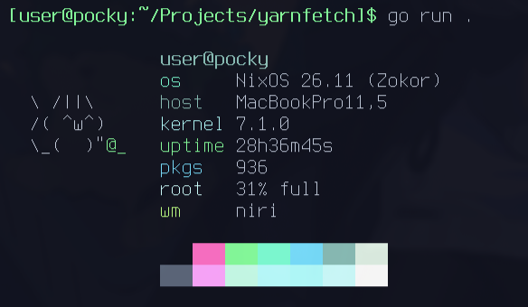

# 🧶 yarnfetch

a simple info utility

## screenshot



## install

### go

```
go install github.com/yaaaarn/yarnfetch@latest
```

or to run temporarily

```
go run github.com/yaaaarn/yarnfetch@latest
```

### nix flake

add to your flake.nix inputs:

```nix
yarnfetch = {
  url = "github:yaaaarn/yarnfetch";
  inputs.nixpkgs.follows = "nixpkgs";

};
```

then add `yarnfetch.packages.${system}.default` to your `environment.systemPackages` or `home-manager` packages.

## dev

```
# enter the dev shell (if using nix)
nix develop

# install dependencies
go mod tidy

# build the binary
go build .
````

## license

mit
